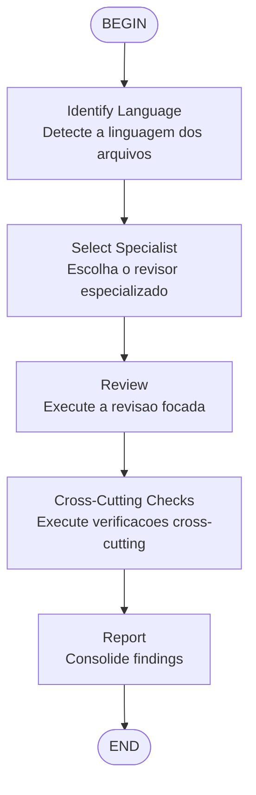

# Code Review Workflow

Revisão de código genérica que detecta a linguagem e escala revisores especializados.

## Mapeamento linguagem → revisor

| Extensão | Revisor especializado |
|----------|----------------------|
| `.py` | `python-reviewer` |
| `.ts`, `.tsx`, `.js`, `.jsx` | `typescript-reviewer` |
| `.rs` | `rust-reviewer` |
| `.go` | `go-reviewer` |
| `.cpp`, `.h`, `.hpp`, `.c` | `cpp-reviewer` |
| `.cs` | `csharp-reviewer` |
| `.java` | `java-reviewer` |
| `.kt` | `kotlin-reviewer` |
| `.dart` | `flutter-reviewer` |
| Outros / Misto | `code-reviewer` |

## Verificações cross-cutting (sempre)

- `security-reviewer` — vulnerabilidades
- `silent-failure-hunter` — falhas silenciosas
- `type-design-analyzer` — design de tipos
- `performance-optimizer` — performance crítica

## Output

Template: Critical → Important → Suggestions → Strengths
