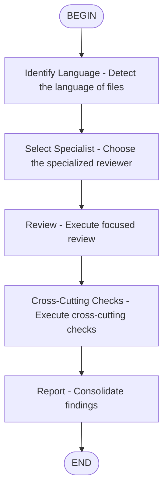

# Code Review Workflow

Generic code review that detects the language and scales specialized reviewers.

## Language → reviewer mapping

| Extension | Specialized reviewer |
|-----------|---------------------|
| `.py` | `python-reviewer` |
| `.ts`, `.tsx`, `.js`, `.jsx` | `typescript-reviewer` |
| `.rs` | `rust-reviewer` |
| `.go` | `go-reviewer` |
| `.cpp`, `.h`, `.hpp`, `.c` | `cpp-reviewer` |
| `.cs` | `csharp-reviewer` |
| `.java` | `java-reviewer` |
| `.kt` | `kotlin-reviewer` |
| `.dart` | `flutter-reviewer` |
| Others / Mixed | `code-reviewer` |

## Cross-cutting checks (always)

- `security-reviewer` — vulnerabilities
- `silent-failure-hunter` — silent failures
- `type-design-analyzer` — type design
- `performance-optimizer` — critical performance

## Output

Template: Critical → Important → Suggestions → Strengths
