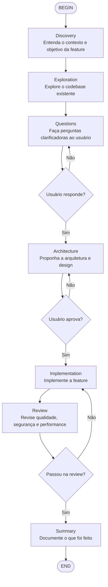

# Feature Development Workflow

Workflow de desenvolvimento de features com 7 fases, orquestrando múltiplos agents do EKC.

## Instruções por nó

**Discovery**: Use `code-explorer` para entender o contexto do projeto.

**Exploration**: Use `code-explorer` + `architect` para mapear o codebase.

**Questions**: Use `AskUserQuestion` para levantar requisitos faltantes.

**Architecture**: Use `architect` ou `code-architect` para propor a solução. Aguarde aprovação.

**Implementation**: Use `coder` subagent ou implemente diretamente. Siga TDD quando possível.

**Review**: Use `code-reviewer`, `security-reviewer` e `type-design-analyzer` para validar.

**Summary**: Use `doc-updater` para atualizar documentação.
