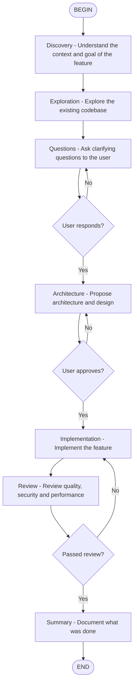

# Feature Development Workflow

Feature development workflow with 7 phases, orchestrating multiple EKC agents.

## Instructions per node

**Discovery**: Use `code-explorer` to understand the project context.

**Exploration**: Use `code-explorer` + `architect` to map the codebase.

**Questions**: Use `AskUserQuestion` to raise missing requirements.

**Architecture**: Use `architect` or `code-architect` to propose the solution. Wait for approval.

**Implementation**: Use `coder` subagent or implement directly. Follow TDD when possible.

**Review**: Use `code-reviewer`, `security-reviewer` and `type-design-analyzer` to validate.

**Summary**: Use `doc-updater` to update documentation.
