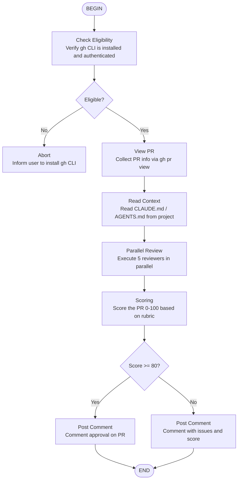

# GitHub Code Review Workflow

Automated GitHub PR review using GitHub CLI (`gh`), with confidence scoring.



## Scoring Rubric (0-100)

| Criterion | Weight |
|-----------|--------|
| Correctness | 25% |
| Code quality | 20% |
| Tests | 20% |
| Security | 15% |
| Documentation | 10% |
| Performance | 10% |

## Parallel reviewers

1. `code-reviewer` — General quality
2. `security-reviewer` — Vulnerabilities
3. `pr-test-analyzer` — Test coverage
4. `type-design-analyzer` — Type design
5. `silent-failure-hunter` — Silent failures

## PR comment format

```markdown
## 🤖 EKC Code Review — Score: XX/100

### Critical Issues
- ...

### Important Issues
- ...

### Suggestions
- ...

### Strengths
- ...

**Verdict:** [APPROVE / REQUEST_CHANGES / COMMENT]
```
