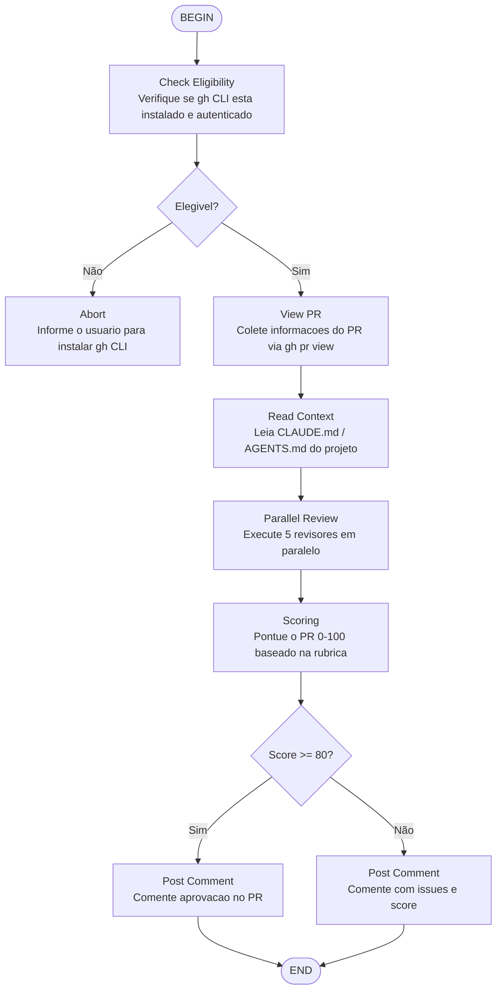

# GitHub Code Review Workflow

Review automatizado de PR no GitHub usando GitHub CLI (`gh`), com scoring de confiança.



## Rubrica de Scoring (0-100)

| Critério | Peso |
|----------|------|
| Corretude | 25% |
| Qualidade de código | 20% |
| Testes | 20% |
| Segurança | 15% |
| Documentação | 10% |
| Performance | 10% |

## Revisores paralelos

1. `code-reviewer` — Qualidade geral
2. `security-reviewer` — Vulnerabilidades
3. `pr-test-analyzer` — Cobertura de testes
4. `type-design-analyzer` — Design de tipos
5. `silent-failure-hunter` — Falhas silenciosas

## Formato do comentário no PR

```markdown
## 🤖 EKC Code Review — Score: XX/100

### Critical Issues
- ...

### Important Issues
- ...

### Suggestions
- ...

### Strengths
- ...

**Verdict:** [APPROVE / REQUEST_CHANGES / COMMENT]
```
