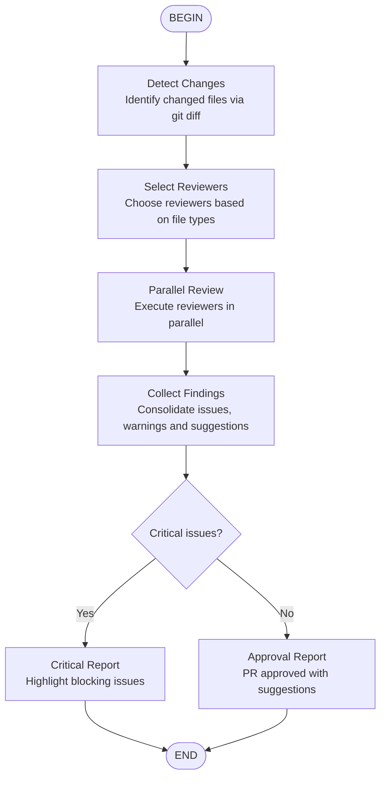

# PR Review Workflow

Orchestrates multiple specialized reviewers for a complete Pull Request review.

## Reviewers by file type

| File type | Recommended reviewers |
|-----------|----------------------|
| `.py` | `python-reviewer`, `pr-test-analyzer` |
| `.ts`, `.tsx`, `.js` | `typescript-reviewer`, `pr-test-analyzer` |
| `.rs` | `rust-reviewer`, `pr-test-analyzer` |
| `.go` | `go-reviewer`, `pr-test-analyzer` |
| `.cpp`, `.h` | `cpp-reviewer`, `pr-test-analyzer` |
| `.cs` | `csharp-reviewer` |
| `.java` | `java-reviewer` |
| `.kt` | `kotlin-reviewer` |
| `.sql`, migrations | `database-reviewer` |
| `.yaml`, `.json` config | `security-reviewer` |
| Any | `code-reviewer`, `silent-failure-hunter`, `type-design-analyzer` |

## Output template

1. **Critical Issues** (blocking)
2. **Important Issues** (should be fixed)
3. **Suggestions** (optional improvements)
4. **Strengths** (what is well done)
5. **Recommended Action** (approve, request changes, etc.)
