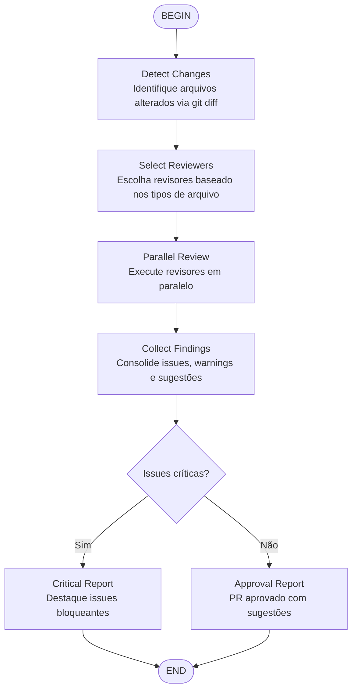

# PR Review Workflow

Orquestra múltiplos revisores especializados para uma revisão completa de Pull Request.

## Revisores por tipo de arquivo

| Tipo de arquivo | Revisores recomendados |
|-----------------|------------------------|
| `.py` | `python-reviewer`, `pr-test-analyzer` |
| `.ts`, `.tsx`, `.js` | `typescript-reviewer`, `pr-test-analyzer` |
| `.rs` | `rust-reviewer`, `pr-test-analyzer` |
| `.go` | `go-reviewer`, `pr-test-analyzer` |
| `.cpp`, `.h` | `cpp-reviewer`, `pr-test-analyzer` |
| `.cs` | `csharp-reviewer` |
| `.java` | `java-reviewer` |
| `.kt` | `kotlin-reviewer` |
| `.sql`, migrations | `database-reviewer` |
| `.yaml`, `.json` config | `security-reviewer` |
| Qualquer | `code-reviewer`, `silent-failure-hunter`, `type-design-analyzer` |

## Template de Output

1. **Issues Críticas** (bloqueantes)
2. **Issues Importantes** (devem ser corrigidas)
3. **Sugestões** (melhorias opcionais)
4. **Pontos Fortes** (o que está bem feito)
5. **Ação Recomendada** (aprovar, requisitar changes, etc.)
